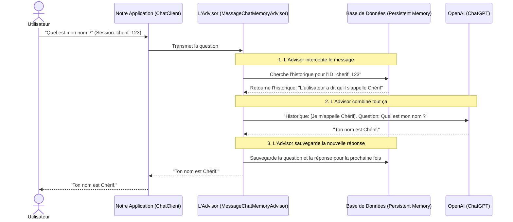

# Comprendre la Mémoire dans Spring AI (Chat Memory)

Bienvenue dans ce guide ! Ce document est fait pour vous aider à comprendre simplement comment on donne une mémoire à notre Intelligence Artificielle (IA) dans Spring Boot.

---

## 1. Conversation History (L'historique de conversation)
Par défaut, une IA (comme ChatGPT) **n'a aucune mémoire**. Chaque question que vous lui posez est traitée comme si c'était votre toute première rencontre.
*   **Le problème :** Si vous lui dites "Je m'appelle Chérif", et qu'ensuite vous demandez "Quel est mon nom ?", elle ne saura pas répondre.
*   **La solution :** Il faut lui renvoyer **tout l'historique** de votre conversation à chaque nouveau message pour lui rafraîchir la mémoire. Spring AI va gérer ça pour nous.

---

## 2. MessageWindowChatMemory (La fenêtre de messages)
Si vous discutez très longtemps avec l'IA, l'historique devient gigantesque !
*   Envoyer un texte immense à l'IA coûte cher (en tokens) et prend du temps.
*   **La solution :** Le `MessageWindowChatMemory`. C'est une technique qui consiste à ne garder en mémoire que les **N derniers messages** (par exemple, les 10 derniers échanges). C'est comme une "fenêtre" qui glisse au fur et à mesure que vous parlez. L'IA oublie les très vieux messages, mais garde le contexte récent.

---

## 3. Session IDs (Les Identifiants de Session)
Imaginez que 5 personnes parlent à votre bot en même temps. Comment l'IA fait-elle pour ne pas mélanger les conversations de tout le monde ?
*   On utilise un **Session ID** (Identifiant de conversation).
*   C'est un petit texte unique pour chaque utilisateur (par exemple `session_cherif_123`).

**Voici la ligne de code où on donne le Session ID à Spring AI :**
```java
// On dit à l'IA : "Pour cette question, utilise la mémoire de la conversation 'username'"
chatClient.prompt()
    .user(message)
    .advisors(advisor -> advisor.param(ChatMemory.CONVERSATION_ID, username))
    .call()
    .content();
```

---

## 4. InMemory vs Persistent Memory
Où est-ce qu'on stocke cet historique ? Il y a deux grandes méthodes :

### A. InMemory (Mémoire Vive / RAM)
L'historique est gardé temporairement dans la mémoire de l'ordinateur.
*   **Avantage :** Ultra rapide et très facile à coder.
*   **Inconvénient :** Si vous arrêtez ou redémarrez votre serveur (l'application Spring Boot), **absolument tout est effacé**. Toutes les conversations sont perdues. C'est fait uniquement pour les tests.

### B. Persistent Memory (Mémoire Persistante)
L'historique est sauvegardé dans une **Base de données** (comme MySQL, PostgreSQL, ou H2 dans notre cas).
*   **Avantage :** Même si le serveur redémarre, les conversations sont toujours là. Les utilisateurs peuvent reprendre leur discussion le lendemain. C'est indispensable pour un vrai projet.

---

## 5. Les Patterns : L'Advisor (Le Conseiller)
Dans le code, on ne modifie pas l'outil principal de l'IA pour lui ajouter une mémoire. On utilise un "Pattern" (une technique de code célèbre) appelé **l'Advisor** (le Conseiller).
*   Un Advisor est un petit module invisible qui vient se "brancher" sur notre `ChatClient` (notre téléphone vers l'IA).
*   Il intercepte notre message avant de l'envoyer, va chercher l'historique dans la base de données, l'ajoute discrètement à notre question, puis l'envoie à l'IA.

**Voici comment on le branche dans le code de configuration :**
```java
@Bean
public ChatClient chatClient(ChatClient.Builder builder, ChatMemory chatMemory) {
    // 1. On fabrique notre "Conseiller" qui va gérer la mémoire
    Advisor memoryAdvisor = MessageChatMemoryAdvisor.builder(chatMemory).build();
    
    // 2. On branche ce conseiller par défaut sur notre ChatClient
    return builder
            .defaultAdvisors(memoryAdvisor)
            .build();
}
```

---

## 6. Graphe d'explication : Comment tout cela fonctionne ensemble ?

Voici un schéma simple qui montre le cheminement d'une question quand la mémoire (l'Advisor) est activée.

