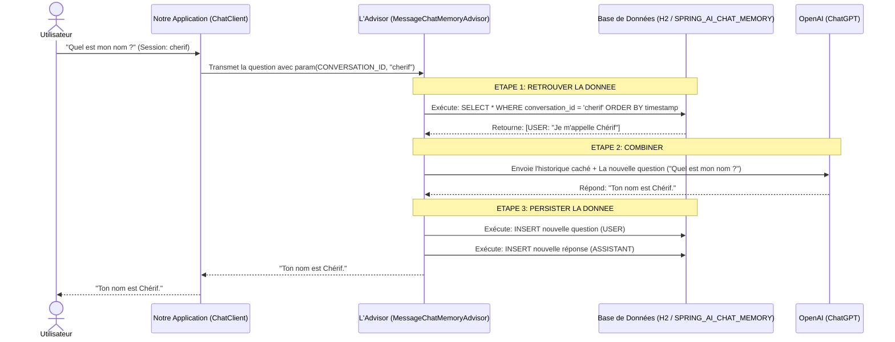

# Comprendre la Mémoire dans Spring AI (Chat Memory)

Bienvenue dans ce guide ! Ce document est fait pour vous aider à comprendre simplement comment on donne une mémoire à notre Intelligence Artificielle (IA) dans Spring Boot.

---

## 1. Conversation History (L'historique de conversation)
Par défaut, une IA (comme ChatGPT) **n'a aucune mémoire**. Chaque question que vous lui posez est traitée comme si c'était votre toute première rencontre.
*   **Le problème :** Si vous lui dites "Je m'appelle Chérif", et qu'ensuite vous demandez "Quel est mon nom ?", elle ne saura pas répondre.
*   **La solution :** Il faut lui renvoyer **tout l'historique** de votre conversation à chaque nouveau message pour lui rafraîchir la mémoire. Spring AI va gérer ça pour nous.

---

## 2. MessageWindowChatMemory (La fenêtre de messages)
Si vous discutez très longtemps avec l'IA, l'historique devient gigantesque !
*   Envoyer un texte immense à l'IA coûte cher (en tokens) et prend du temps.
*   **La solution :** Le `MessageWindowChatMemory`. C'est une technique qui consiste à ne garder en mémoire que les **N derniers messages** (par exemple, les 10 derniers échanges). C'est comme une "fenêtre" qui glisse au fur et à mesure que vous parlez. L'IA oublie les très vieux messages, mais garde le contexte récent.

---

## 3. Session IDs (Les Identifiants de Session)
Imaginez que 5 personnes parlent à votre bot en même temps. Comment l'IA fait-elle pour ne pas mélanger les conversations de tout le monde ?
*   On utilise un **Session ID** (Identifiant de conversation).
*   C'est un petit texte unique pour chaque utilisateur (par exemple `session_cherif_123`).

**Voici la ligne de code où on donne le Session ID à Spring AI :**
```java
// On dit à l'IA : "Pour cette question, utilise la mémoire de la conversation 'username'"
chatClient.prompt()
    .user(message)
    .advisors(advisor -> advisor.param(ChatMemory.CONVERSATION_ID, username))
    .call()
    .content();
```

---

## 4. InMemory vs Persistent Memory
Où est-ce qu'on stocke cet historique ? Il y a deux grandes méthodes :

### A. InMemory (Mémoire Vive / RAM)
L'historique est gardé temporairement dans la mémoire de l'ordinateur.
*   **Avantage :** Ultra rapide et très facile à coder.
*   **Inconvénient :** Si vous arrêtez ou redémarrez votre serveur (l'application Spring Boot), **absolument tout est effacé**. Toutes les conversations sont perdues. C'est fait uniquement pour les tests.

### B. Persistent Memory (Mémoire Persistante)
L'historique est sauvegardé dans une **Base de données** (comme MySQL, PostgreSQL, ou H2 dans notre cas).
*   **Avantage :** Même si le serveur redémarre, les conversations sont toujours là. Les utilisateurs peuvent reprendre leur discussion le lendemain. C'est indispensable pour un vrai projet.

---

## 5. Comment la donnée est-elle vraiment persistée et retrouvée ? (Le détail en base de données)

Lorsqu'on utilise une mémoire persistante avec H2 (ou une autre base relationnelle SQL) via JDBC dans Spring AI, il y a un travail invisible qui se passe dans les coulisses de la base de données.

### A. Le Schéma de la Base de Données (La structure)
Pour pouvoir sauvegarder les messages, Spring AI a besoin d'une table SQL spécifique. C'est ce que nous avons défini dans notre fichier `schema-h2db.sql` :

```sql
CREATE TABLE SPRING_AI_CHAT_MEMORY (
    conversation_id VARCHAR(36) NOT NULL, -- C'est ici qu'on stocke le Session ID ("cherif")
    content LONGVARCHAR NOT NULL,         -- C'est le contenu du message ("Je m'appelle cherif")
    type VARCHAR(10) NOT NULL,            -- C'est l'auteur du message (USER pour vous, ASSISTANT pour l'IA)
    "timestamp" TIMESTAMP                 -- L'heure exacte du message pour pouvoir les trier par ordre chronologique
);
```

### B. Comment la donnée est persistée (Sauvegardée) ?
Quand vous posez une question ("Bonjour") et que l'IA vous répond ("Bonjour, comment puis-je vous aider ?"), l'Advisor `MessageChatMemoryAdvisor` fait deux requêtes `INSERT` automatiquement (en utilisant JDBC) :

1. Il sauvegarde votre question :
   `INSERT INTO SPRING_AI_CHAT_MEMORY (conversation_id, content, type) VALUES ('cherif', 'Bonjour', 'USER');`
2. Il sauvegarde la réponse de l'IA :
   `INSERT INTO SPRING_AI_CHAT_MEMORY (conversation_id, content, type) VALUES ('cherif', 'Bonjour, comment puis-je vous aider ?', 'ASSISTANT');`

### C. Comment la donnée est retrouvée (Chargée) ?
Quand vous posez la question suivante, l'Advisor a besoin de retrouver l'historique avant d'appeler l'IA. Il fait alors une requête `SELECT` dans la base de données en filtrant par votre `conversation_id` (votre Session ID) :

`SELECT content, type FROM SPRING_AI_CHAT_MEMORY WHERE conversation_id = 'cherif' ORDER BY timestamp ASC LIMIT 10;`

*(Le `LIMIT 10` correspond justement à la fameuse fenêtre `MessageWindowChatMemory` qui ne prend que les 10 derniers messages pour ne pas tout saturer !)*

---

## 6. Les Patterns : L'Advisor (Le Conseiller)
Dans le code, on ne modifie pas l'outil principal de l'IA pour lui ajouter une mémoire. On utilise un "Pattern" (une technique de code célèbre) appelé **l'Advisor** (le Conseiller).
*   Un Advisor est un petit module invisible qui vient se "brancher" sur notre `ChatClient` (notre téléphone vers l'IA).
*   Il intercepte notre message avant de l'envoyer, va chercher l'historique dans la base de données (comme vu dans la section 5), l'ajoute discrètement à notre question, puis l'envoie à l'IA.

**Voici comment on le branche dans le code de configuration :**
```java
@Bean
public ChatClient chatClient(ChatClient.Builder builder, ChatMemory chatMemory) {
    // 1. On fabrique notre "Conseiller" qui va gérer la mémoire (il utilisera JDBC pour parler à la BDD)
    Advisor memoryAdvisor = MessageChatMemoryAdvisor.builder(chatMemory).build();
    
    // 2. On branche ce conseiller par défaut sur notre ChatClient
    return builder
            .defaultAdvisors(memoryAdvisor)
            .build();
}
```

---

## 7. Graphe d'explication : Le cycle complet avec Base de Données

Voici un schéma simple qui montre le cheminement exact d'une question, de la persistance, et de la récupération de la donnée en base.



---

## 8. Cas pratique pour s'entraîner : Créer un "Professeur d'Anglais" avec mémoire

Voici un exercice complet pour vous entraîner à expliquer ce concept à quelqu'un. Nous allons créer un petit bot qui se souvient des fautes d'anglais de l'utilisateur.

### L'objectif (L'exercice à réaliser) :
Créer une route d'API `/api/english-teacher` où un utilisateur peut discuter en anglais. Le bot doit se souvenir de la conversation pour pouvoir faire un bilan des erreurs à la fin.

### Le Code (La solution) :

**1. Le contrôleur (EnglishTeacherController.java)**
```java
package MeteoAIBot.com;

import org.springframework.ai.chat.client.ChatClient;
import org.springframework.ai.chat.memory.ChatMemory;
import org.springframework.web.bind.annotation.GetMapping;
import org.springframework.web.bind.annotation.RequestParam;
import org.springframework.web.bind.annotation.RestController;

@RestController
public class EnglishTeacherController {

    private final ChatClient chatClient;
    
    // Le "System Prompt" donne la personnalité à l'IA
    private static final String SYSTEM_PROMPT = "Tu es un professeur d'anglais strict mais bienveillant. " +
            "L'utilisateur va te parler en anglais. Corrige ses fautes, explique la règle, " +
            "et relance la conversation. Garde toujours en mémoire ce qu'il a dit avant.";

    // On utilise le ChatClient configuré avec l'Advisor (mémoire) que nous avons vu plus haut
    public EnglishTeacherController(ChatClient.Builder builder, ChatMemory chatMemory) {
        this.chatClient = builder
                .defaultSystem(SYSTEM_PROMPT)
                // L'Advisor de mémoire est branché ici !
                .defaultAdvisors(new org.springframework.ai.chat.client.advisor.MessageChatMemoryAdvisor(chatMemory))
                .build();
    }

    /**
     * @param eleveName C'est notre Session ID ! Il permet de séparer les élèves.
     * @param message Le message en anglais de l'élève.
     */
    @GetMapping(value = "/api/english-teacher", produces = "text/plain;charset=UTF-8")
    public String discuterAvecLeProf(
            @RequestParam("eleveName") String eleveName,
            @RequestParam("message") String message) {

        return chatClient.prompt()
                .user(message)
                // On passe le Session ID à l'Advisor pour qu'il retrouve la bonne mémoire
                .advisors(advisor -> advisor.param(ChatMemory.CONVERSATION_ID, eleveName))
                .call()
                .content();
    }
}
```

### Comment tester l'exercice (Le scénario pédagogique) :

Pour tester, vous utilisez Postman ou votre navigateur web, et vous faites plusieurs requêtes d'affilée pour le MÊME `eleveName`.

*   **Requête 1 :** L'élève fait une faute basique.
    `http://localhost:8081/api/english-teacher?eleveName=marc&message=I is a developer.`
    *L'IA va répondre : "On dit I am a developer. Que fais-tu comme développement ?"*

*   **Requête 2 :** L'élève répond, sans se présenter de nouveau.
    `http://localhost:8081/api/english-teacher?eleveName=marc&message=I make websites.`
    *L'IA va répondre : "Très bien ! Quel langage utilises-tu pour faire des sites web ?"*

*   **Requête 3 : Le test ultime de la mémoire !**
    `http://localhost:8081/api/english-teacher?eleveName=marc&message=Peux-tu me rappeler la première faute que j'ai faite tout à l'heure ?`
    
    *C'est ici que la magie opère ! L'IA va aller lire la base de données (grâce au Session ID `marc`), retrouver le premier message "I is a developer", et répondre : "Oui, tu avais dit 'I is a developer' au lieu de 'I am'."*

### Que se passe-t-il si un autre élève arrive ? (Test du Session ID)

*   **Requête 4 :** Un nouvel élève (Chérif) arrive. On change le Session ID !
    `http://localhost:8081/api/english-teacher?eleveName=cherif&message=Peux-tu me rappeler ma première faute ?`
    
    *L'IA va répondre : "C'est notre premier échange, tu n'as pas encore fait de faute !". La mémoire de "marc" n'est pas mélangée avec celle de "cherif" grâce au `conversation_id` !*